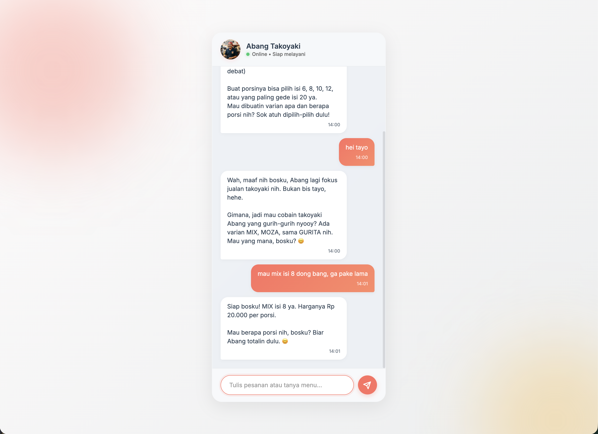

# Abang Takoyaki (Asisten Penjualan AI) 🐙

Repositori ini berisi aplikasi Chatbot AI yang dirancang sebagai asisten penjualan virtual. Aplikasi ini memanfaatkan Google Gemini API untuk memproses bahasa alami, menangani interaksi pelanggan, dan mengikuti alur penjualan yang telah ditentukan.

> **Final Project Submission**
> This repository is submitted as a Final Project for the **"AI Productivity and AI API Integration for Developers"** course, organized by **Hacktiv8**.

## Deskripsi

Aplikasi ini bertindak sebagai agen layanan pelanggan untuk toko Takoyaki. Chatbot ini dilengkapi dengan fitur percakapan yang mengerti konteks (*context-aware*) dengan mempertahankan riwayat obrolan, sehingga interaksi berjalan secara natural. Sistem *backend* secara ketat menerapkan instruksi sistem khusus (*system instruction*), seperti menetapkan daftar harga menu, mencegah tawar-menawar, dan mewajibkan pelanggan memberikan alamat pengiriman sebelum memproses pesanan.



## Teknologi yang Digunakan

- **Frontend**: HTML5, CSS3, Vanilla JavaScript
- **Backend**: Node.js, Express.js
- **Integrasi AI**: Google Generative AI SDK (`@google/genai`)

## Prasyarat

- [Node.js](https://nodejs.org/) (disarankan v18.x atau lebih baru)
- Kunci API Google Gemini yang valid dari [Google AI Studio](https://aistudio.google.com/)

## Instalasi dan Persiapan

1. **Klon Repositori**
   Unduh atau klon repositori proyek ini ke direktori lokal Anda.

2. **Instal Dependensi**
   Buka terminal di dalam direktori proyek dan instal modul Node yang diperlukan:
   ```bash
   npm install
   ```

3. **Konfigurasi Environment**
   Salin templat konfigurasi *environment* dan atur kunci API Anda:
   ```bash
   cp .env.example .env
   ```
   Buka file `.env` dan masukkan kunci API Anda:
   ```env
   PORT=3000
   GEMINI_API_KEY=masukkan_api_key_anda_di_sini
   ```

4. **Jalankan Aplikasi**
   Jalankan server Express:
   ```bash
   node index.js
   ```

5. **Akses Antarmuka Web**
   Buka *browser* web Anda dan navigasikan ke `http://localhost:3000` untuk berinteraksi dengan chatbot.

## Struktur Proyek

- `/public`: Berisi aset *frontend* statis (`index.html`, `style.css`, `script.js`).
- `index.js`: Titik masuk (*entry point*) utama *backend* yang menangani rute Express dan integrasi API.
- `systemInstruction.js`: Modul khusus yang mendefinisikan perilaku AI, batasan, dan aturan bisnis toko.
- `.env.example`: Templat panduan untuk *environment variables* yang dibutuhkan sistem.
